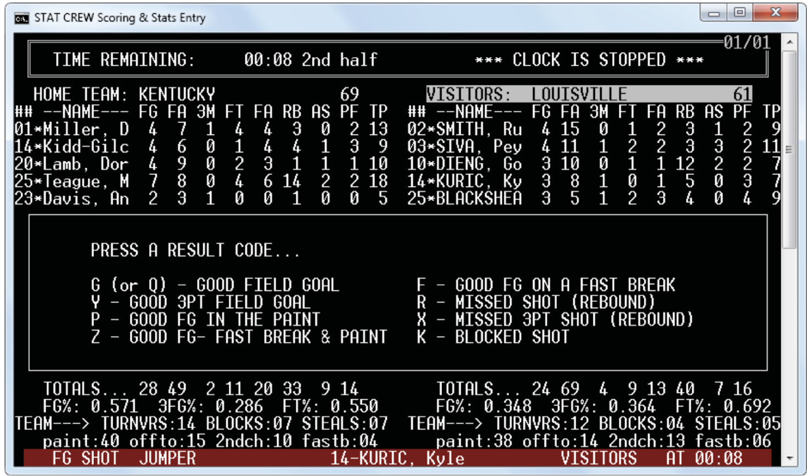
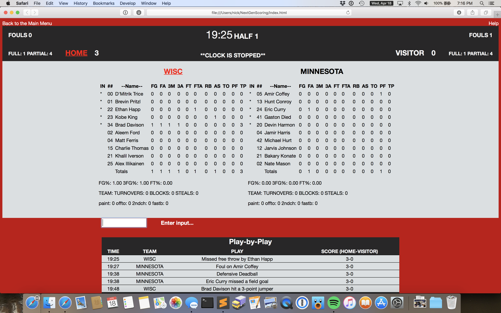
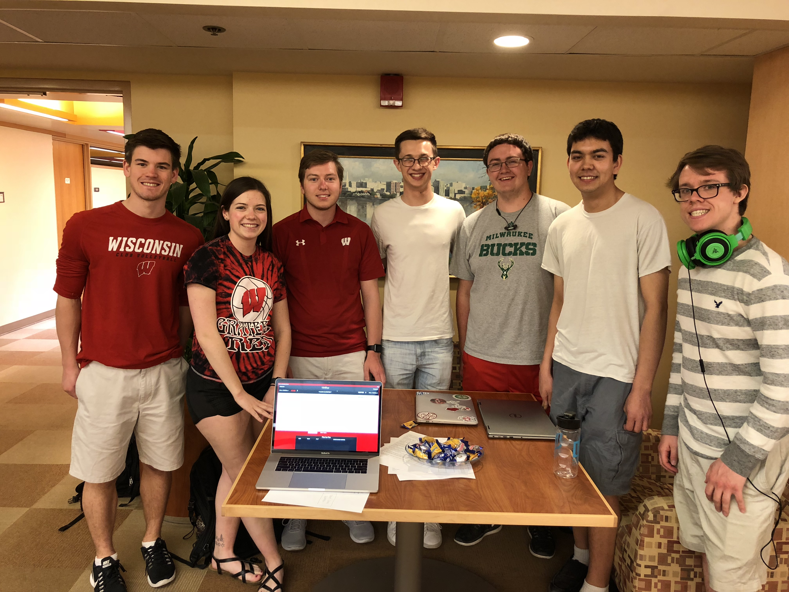

# NextGenScoring
The Stat Crew System for Basketball, the current software used by the UW Athletic Department to score basketball games, is extremely outdated and obsolete (it cannot run on Window operating systems past XP). The purpose of this project is to develop a modern replacement to the software which can be used via a web application. Our program allows scorekeepers to document all relevant statistics related to the game being played, and then export it to both a file which the stadium’s scoreboards reference, as well as any external media sources which are following the game. 

This project was completed by myself and six other team members for a CS 506 Software Engineering project.  This class teaches software engineering principles while having students spend an entire semester in teams building a software application starting with the planning stages and eventually releasing a demo at the end of the semester.  Each student had to pitch a project idea during the first week and I am the one that proposed the idea of a basketball scoring app.  Enough people voted on it and were assigned to the team, so it was great to see that others had an interest in the idea, which was inspired by my job at the UW Athletic Department where I set up statisticians' scoring computers at basketball, football and hockey games.  This class was my first experience in a group project, which was challening but overall very rewarding.  I enjoyed all of my group members and we all worked hard to complete the project.

##Old Software

This is what the current software being used to record and store in-game stats at UW basketball games looks like.

##Our Software

This is what our solution looks like!

##Team Picture

Our team! From left to right: Brett, Sara, Me (Nick), Noah, Doug, Damon, Nate

# Installation
To run NextGenScoring, you must first download Node.js and install Electron. Download Node.js [here](https://nodejs.org/en/). To make sure it is installed, run

> node -v

Once you have Node downloaded, install Electron and other dependencies using npm by running

> npm install Electron

Install mocha- the testing framework
> npm install mocha 

Install nyc for code coverage metrics
> npm install nyc

Install filereader
> npm install filereader

If you can't run npm start or npm test then look at the package.json and the devDependencies and dependencies.
If they haven't been install run npm install (name of dependency) for all of them until you can get npm start and test to run.

To prepare for the frontend tests, 
- Download Python 3.6.4 [here](https://www.python.org/downloads/) 
- Download Mozilla Firefox 57.0 [here](https://filehippo.com/download_firefox/79535/) 
- Install geckodriver 0.20.0 [here](https://github.com/mozilla/geckodriver/releases) 
- Edit your environmental variables to ensure that your computer can find the geckodriver. (As an example, the geckodriver.exe file is in my C:\Users\neu3\bin folder, and C:\Users\neu3\bin\geckodriver.exe is in my Path user variable) 
This link can help add something to your PATH variable: [here](https://www.java.com/en/download/help/path.xml)
- Once python is installed, to install Selenium in the terminal run
> pip install selenium

# Usage and Testing
Due to an unexpected issue between Selenium and Electron, our frontend tests are not able to be ran alongside the backend and integration tests. 

To run the frontend tests, in the "NextGenScoring" directory, run the Python scripts with:
> python frontend\ tests/name_of_file.py 

To run our backend tests, run

> npm test

This will run our entire backend test suite and provide pass/fail messages along with code coverage statistics.

To manually use the software without running any test scripts, run

> npm start

This should lead you to a login page asking for a password,

The password to enter the application is:
>123

